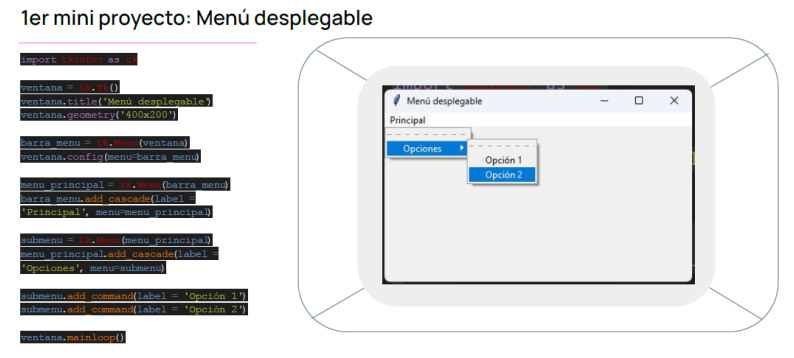

# CONVERSOR-INFO - Mini proyecto grupo 15 - Etapa 2: Desarrollo Web - INFORMATORIO

---

## 📋 Introducción

**Propuesta del Mini Proyecto:**
Como parte de nuestro aprendizaje en esta 2da etapa desarrollo web, desarrollaremos un conversor de magnitudes físicas utilizando Python y Tkinter. El proyecto nos desafió a:

- **Experimentar** con el código base proporcionado (menú desplegable)
- **Aplicar** conceptos de Tkinter, módulos y estructuras de código
- **Trabajar en equipo** usando metodologías ágiles
- **Potenciar** nuestra creatividad y comunicación grupal

**Elección del Mini proyecto:** Seleccionamos el menú desplegable como punto de partida para crear una interfaz intuitiva y escalable.

---

## 🛠️ Desarrollo

### **Elección de Sistemas y Magnitudes**
Para nuestro conversor, seleccionamos **4 sistemas de unidades** fundamentales en física e ingeniería:
- **Sistema Internacional (SI)** - Estándar global
- **Sistema CGS** - Usado en contextos científicos específicos  
- **Sistema Anglosajón (US)** - Ampliamente utilizado en países de influencia inglesa
- **Sistema Técnico** - Empleado en aplicaciones de ingeniería

Las **5 magnitudes físicas** elegidas cubren aspectos fundamentales:
- **Masa** - Propiedad básica de la materia
- **Longitud** - Dimensión espencial esencial
- **Fuerza** - Interacción fundamental
- **Temperatura** - Medida de energía térmica
- **Energía** - Capacidad para realizar trabajo

### **Decisión Arquitectónica: Separación de Lógicas**

**1. Módulo de Conversiones Matemáticas** (`ConversionesMatematicas.py`)
- Contiene **exclusivamente funciones matemáticas** puras
- Cada función realiza **una conversión específica** entre unidades
- **Independiente de la interfaz** - puede reutilizarse en otros proyectos
- **Fácil mantenimiento** - las fórmulas están centralizadas en un solo lugar

**2. Módulo de Interfaz y Lógica** (`conversor.py`)  
- Gestiona **toda la interacción con el usuario**
- Contiene la **lógica de control** que orquesta las conversiones
- Maneja **estados de selección** (magnitud y sistema)
- Controla **validaciones** y **formateo de resultados**

### **Funcionamiento del Sistema**

**Flujo Integral:**
1. **Inicialización**: La aplicación muestra una pantalla de bienvenida con arte ASCII
2. **Selección de Magnitud**: El usuario elige una magnitud del menú desplegable
3. **Configuración Dinámica**: La interfaz se adapta mostrando las unidades correspondientes
4. **Entrada de Datos**: Ingreso del valor numérico mediante un display tipo calculadora
5. **Selección de Sistema Origen**: Elección del sistema de unidades mediante botones dedicados
6. **Procesamiento**: 
   - El módulo principal detecta la magnitud y sistema seleccionados
   - Invoca las **funciones específicas** del módulo matemático
   - Realiza **tres conversiones automáticas** a los otros sistemas
7. **Presentación de Resultados**: Muestra las conversiones formateadas en un área tipo terminal

---

## 👥 Integrantes

**Equipo de Desarrollo:**
- **Lacunza Quijano Xavier**
- **Maia Valentina Zalazar** 
- **Figueroa R. Sebastian**
- **Gonzalo Alzu**
- **Saade Wadih Antonio**
- **Pucheta Rolando Ignacio**

**Organización del Proyecto:**
Cada integrante contribuyó al desarrollo de diferentes magnitudes físicas y componentes del sistema, Utilizamos **Trello** para organizar las tareas y coordinar el desarrollo del proyecto, permitiéndonos trabajar de manera colaborativa y eficiente.
